<!-- ═══════════════════════════════  HEADER  ═══════════════════════════════ -->

  

  

  
  
  
  
  
  

  
  
  

<!-- ═══════════════════════════════  ABOUT  ═══════════════════════════════ -->
<h2 align="center">⟨ about me ⟩</h2>

  

$$
\color{#ec4899}{\text{Software}}\ \times\ \color{#a855f7}{\text{Mathematics}}\ =\ \color{white}{\lim_{t \to \infty} \text{curiosity}(t)}
$$

<!-- ═══════════════════════════════  EDUCATION  ═══════════════════════════════ -->
<h2 align="center">🎓 education</h2>

  

| | Faculty | Program | Years |
|:-:|:--|:--|:-:|
| 💻 | **Faculty of Technical Sciences** (FTN), Novi Sad | Software Engineering | `2024 → 2028` |
| ∑ | **Faculty of Sciences** (PMF), Novi Sad | Theoretical Mathematics | `2026 → 2028` |

<!-- ═══════════════════════════════  ACHIEVEMENTS  ═══════════════════════════════ -->
<h2 align="center">🏆 hackathons & competitions</h2>

<table>
  <tr>
    <td align="center" width="50%">
       
      <h3>⚡ Web3 / Solana Hackathon</h3>
      Built <a href="https://github.com/vedranbajic4/solana-debugger"><b>Solana Debugger</b></a>: paste a transaction signature and get back the exact <b>Rust line that failed</b>, decoded errors, SBF disassembly and Ghidra pseudocode.  
      
      
      
      
    </td>
    <td align="center" width="50%">
       
      <h3>🧠 Codeforces Expert</h3>
      Peak rating <b>1837</b> on <a href="https://codeforces.com/profile/veks_the_boss">Codeforces</a>, plus regular contests on CodeChef, LeetCode and HackerRank. Progress is tracked in <a href="https://github.com/vedranbajic4/Competitive-Programming"><b>Competitive-Programming</b></a>.  
      
      
      
    </td>
  </tr>
  <!--
    ➕ ADD MORE ACHIEVEMENTS — copy this row template:
  <tr>
    <td align="center">
       
      <h3>🥇 Event name — placement</h3>
      Short description of what you built.
    </td>
    <td align="center"> ... </td>
  </tr>
  -->
</table>

<!-- ═══════════════════════════════  PROJECTS  ═══════════════════════════════ -->
<h2 align="center">🚀 featured projects</h2>

<table>
  <tr>
    <td width="50%" valign="top">
      <h3><a href="https://github.com/vedranbajic4/solana-debugger">🔬 Solana Debugger</a></h3>
      Source-level transaction debugger for Solana. ELF parsing, DWARF symbols → Rust source mapping, and a Ghidra decompilation pipeline.  
      <code>Rust</code> <code>TypeScript</code> <code>React</code> <code>Express</code>
    </td>
    <td width="50%" valign="top">
      <h3><a href="https://github.com/vedranbajic4/graph-structure-visualizer">🕸️ Graph Structure Visualizer</a></h3>
      Plugin-based platform that parses JSON / XML / RDF into graphs, with interactive D3.js views, multiple workspaces and a CLI.  
      <code>Python</code> <code>Django</code> <code>Flask</code> <code>D3.js</code>
    </td>
  </tr>
  <tr>
    <td width="50%" valign="top">
      <h3><a href="https://github.com/vedranbajic4/Industrial-Processing-System">🏭 Industrial Processing System</a></h3>
      Thread-safe, priority-based job processor with async execution, an event-driven design, retry logic and LINQ → XML reports.  
      <code>C#</code> <code>.NET</code> <code>Concurrency</code>
    </td>
    <td width="50%" valign="top">
      <h3><a href="https://github.com/vedranbajic4/mrs-team27-Lucky3">🚕 Lucky3 — Ride Sharing</a></h3>
      Full-stack Uber-style ride app: Spring Boot backend, Angular web client and a native Android app (team project).  
      <code>Java</code> <code>Spring Boot</code> <code>Angular</code> <code>Android</code>
    </td>
  </tr>
  <tr>
    <td width="50%" valign="top">
      <h3><a href="https://github.com/vedranbajic4/parallel-web-scrapper">🕷️ Parallel Web Scraper</a></h3>
      High-throughput scraper using Intel TBB for parallel fetching, parsing and analysis of web pages.  
      <code>C++</code> <code>TBB</code> <code>Parallelism</code>
    </td>
    <td width="50%" valign="top">
      <h3><a href="https://github.com/vedranbajic4/1010-AI-Solver">🧩 1010! AI Solver</a></h3>
      Monte Carlo Tree Search agent that picks the best moves in the <i>1010!</i> puzzle game.  
      <code>C++</code> <code>MCTS</code> <code>Game AI</code>
    </td>
  </tr>
</table>

  
<b>✨ click to see more projects</b>

   

| Project | What it is | Stack |
|:--|:--|:-:|
| [🧱 maze-game](https://github.com/vedranbajic4/maze-game) | OOP maze escape: collect items, avoid the Minotaur | `C++` |
| [💘 Cupidon](https://github.com/vedranbajic4/Cupidon) | Publisher–subscriber app simulating a chaotic cupid | `C#` `ASP.NET` |
| [♟️ Checkers AI](https://github.com/vedranbajic4/Checkers---minimax-alpha-beta) | Minimax with alpha-beta pruning | `Python` |
| [🔎 search-engine](https://github.com/vedranbajic4/search-engine) | Full-text search over an algorithms & DS textbook PDF | `Python` |
| [🏨 hotel-organisation](https://github.com/vedranbajic4/hotel-organisation-OOP-Java) | GUI hotel management for managers, guests, services | `Java` |
| [🧮 postfix-infix-calculator](https://github.com/vedranbajic4/postfix-infix-calculator) | Infix & postfix expression evaluator | `Python` |

<!-- ═══════════════════════════════  TECH STACK  ═══════════════════════════════ -->
<h2 align="center">🛠️ tech stack</h2>

   
   
  

  
<b>🧪 what I'm exploring right now</b>

   
  

    Software architecture & design patterns · backend systems · parallel & concurrent programming · Web3 tooling · formal proofs & abstract math
  

<!-- ═══════════════════════════════  STATS  ═══════════════════════════════ -->
<h2 align="center">📊 github stats</h2>

  
  

  

  <picture>
    <source media="(prefers-color-scheme: dark)" srcset="https://raw.githubusercontent.com/vedranbajic4/vedranbajic4/output/snake-dark.svg"/>
    <source media="(prefers-color-scheme: light)" srcset="https://raw.githubusercontent.com/vedranbajic4/vedranbajic4/output/snake-light.svg"/>
    
  </picture>

<!-- ═══════════════════════════════  FOOTER  ═══════════════════════════════ -->

  

  

